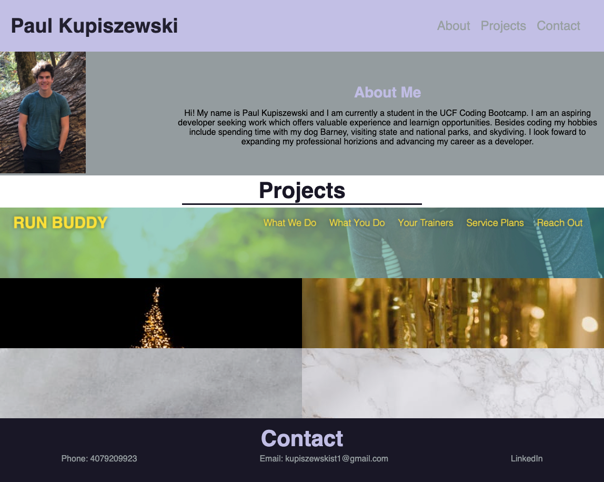

# Portfolio
A personal portfolio to enable potential employers to view my work, experience, and contact information in one easy to access location.  The portfolio seeks to display the level of proficiency I currently have with html and css showcasing responsive design as well as a knowledge of css grid and flexbox.
## Deployed Page
https://paulkup.github.io/portfolio/
## Finished Website
